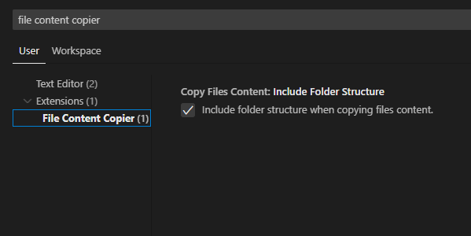

# FILE CONTENT COPIER WEB

  

This is the browser implementation of my extension [File content copier](https://github.com/migmm/file-content-copier), designed for use in browser-based code editors compatible with VS Code.

Did it ever happen to you that you wanted to copy the content of multiple files to the clipboard and had to do the tedious work of copying them one by one? With this extension, you'll be able to copy the content of the files you select in the VSCode explorer and take it directly to the clipboard.

## Features

- With a simple right-click, you can copy the content of the files you select.
- It takes up minimal memory space and doesn't interfere with anything.
- Unlimited amount of characters to copy (determined by your computer's memory).
- Each copied text appears with its corresponding name.
- Show folder structure (configurable)

## Quick Start

- Install extension in VSCode.
- Select the files you want to copy the content of.
- Right-click and select "Copy file content".

And that´s all! Now yo have the content of the files you selected in the clipboard to paste wherever you want.

#### Folder structure configuration

## Build instructions

    1. Install vsce

        npm install -g @vscode/vsce

    2. Package

        vsce package

    You can also run 

        npm run compile 

If you want to test the extension in a web browser editor before compile run

    npm run open-in-browser 

## License

MIT
